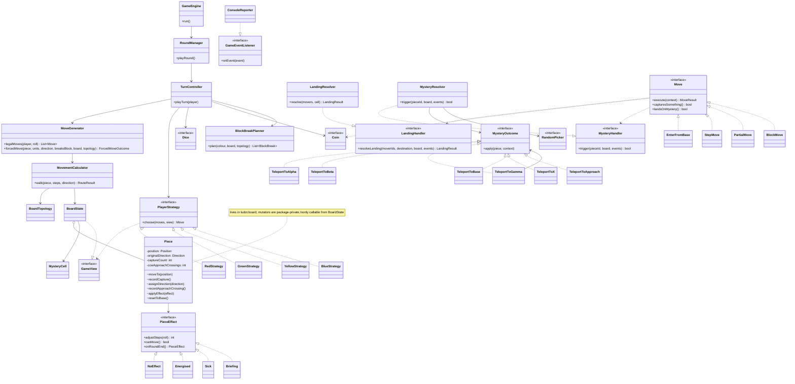
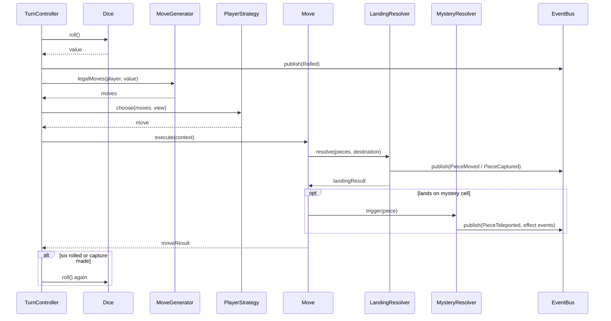

# LUDO-T — Design Document

This document fixes the architecture for the LUDO-T simulation and explains every decision behind it: the data structures, the design patterns, how SOLID and OOP principles apply, the alternatives that were rejected, and the program's efficiency.

It is **binding** for implementation, alongside `ASSUMPTIONS.md` (rule interpretations) and `CLAUDE.md` (working rules). The implementation language is Java 21 (LTS) with Maven (see `CLAUDE.md` for conventions). Signatures here are written as compact pseudocode.

---

## 1. Design Forces

These are the properties of the problem that drive the design decisions.

| # | Force | Consequence |
|---|---|---|
| F1 | The rules are complex and interact with each other (blocks, directions, eligibility, teleports, effects). | Rule logic must be in one place, so it is consistent and testable. |
| F2 | Four players with different behaviours, and the brief invites new ones. | Player behaviour must be pluggable and isolated from the rules. |
| F3 | Output must match exact message templates. | Output formatting must be separate from game logic. |
| F4 | Heavy use of randomness (dice, coin, mystery cell, teleports, Alpha, Blue). | Randomness must be injectable so games are reproducible and each rule can be tested with stubbed values (Mockito). |
| F5 | Small, fixed-size board (52 + 20 cells, 16 pieces). | Simple fixed-size structures beat general-purpose ones. |
| F6 | Assessment focuses on clean code and justified design. | Every pattern must solve a named problem; no speculative abstraction. |

---

## 2. Architecture Overview

### 2.1 The central decision

> **The engine decides what is legal. Strategies decide what is preferred.**

`MoveGenerator` produces the complete list of legal moves for a roll. A `PlayerStrategy` only selects one move from that list. The `GameEngine` executes it.

Why this matters:
- A strategy **cannot** break a rule, because it can only choose from legal moves (F1).
- The rules are written once, not four times, one per strategy (DRY, F1).
- A new player type is a new class and nothing else changes (OCP, F2).
- Strategies can be tested by feeding them hand-built move lists, without running a game.

### 2.2 Packages

| Package | Contents | Depends on |
|---|---|---|
| `domain` | `Colour`, `Direction`, `PieceId`, `Position`, `PieceEffect`, `MysteryOutcomeKind` | — |
| `board` | `BoardTopology`, `BoardState`, `MysteryCell`, `MysteryCellTick`, `Piece`, `GameView` | `domain`, `random` |
| `moves` | `Move` and its implementations, `LandingHandler`, `MysteryHandler` | `domain`, `board`, `events`, `random` |
| `rules` | `MovementCalculator`, `MoveGenerator`, `LandingResolver`, `MysteryResolver`, `MysteryOutcome` implementations | `domain`, `board`, `moves`, `random`, `events` |
| `players` | `PlayerStrategy`, four strategies | `domain`, `moves`, `board` |
| `engine` | `GameEngine`, `TurnController`, `RoundManager`, `Standings` | all of the above |
| `events` | `GameEvent` types, `GameEventListener`, `EventBus` | `domain` |
| `output` | `ConsoleReporter`, `MessageTemplates` | `events`, `domain` |
| `random` | `Dice`, `Coin`, `RandomPicker` interfaces and their seeded implementations (tests stub the interfaces with Mockito) | — |
| `app` | `Main`, `GameFactory` (composition root) | everything |

Dependencies point one way only, towards `domain`. `players` does **not** depend on `engine` or `rules`, so a strategy cannot reach into the rule logic.

### 2.3 Component responsibilities

| Component | Single responsibility |
|---|---|
| `BoardTopology` | Pure geometry: track size, X/Approach per colour, Alpha/Beta/Gamma, stepping one cell in a given direction. Immutable. No game state. |
| `BoardState` | Where every piece is: track occupancy, home-straight occupancy, base and home. Answers occupancy queries; derives blocks. The sole public gateway for mutating a `Piece`, so occupancy can never fall out of sync with a piece's own position. Implements `GameView`, the read-only subset of its query methods that `PlayerStrategy` depends on. |
| `MysteryCell` | Mystery cell location, rounds remaining, previous location, spawn timer (A-28). |
| `Piece` | One piece's state: position, original direction, capture count, counterclockwise crossing counter, active effect. Lives in `board`; its mutators are package-private, so only `BoardState` can change it. |
| `PieceEffect` | Timed effect on a piece (Energised, Sick, Briefing): modifies steps, blocks movement, counts down. |
| `MovementCalculator` | Walks a route cell by cell: applies Rule 9/10, T-1, T-7, and block obstruction (T-3). Returns a destination or the reason it is illegal. |
| `MoveGenerator` | Builds every legal `Move` for a player and roll, including block moves (T-4) and partial moves (A-16); also builds a single forced break-move via `forcedMove` for T-6/A-22. |
| `BlockBreakPlanner` | Snapshots which blocks a colour owns and how each must break (who stays, who leaves, units each) when a third consecutive six lands, before any member moves (T-6/A-22). |
| `Move` | A command object describing one legal move, which can execute itself. |
| `LandingResolver` | What happens when something lands on a cell: captures (Rule 6, T-2, T-8), block formation, obstruction. Shared by normal moves and teleports so the logic isn't duplicated. Implements `moves.LandingHandler`, so a `Move` can trigger landing resolution without the `moves` package depending on `rules` (dependency inversion). |
| `MysteryResolver` | Mystery cell trigger: picks an outcome, teleports, resolves A-31's landing rules (T-11); applies Alpha/Beta/Gamma effects in later phases (T-12 to T-15). Implements `moves.MysteryHandler`, so a `Move` can trigger it without the `moves` package depending on `rules` — same dependency-inversion reasoning as `LandingResolver`/`LandingHandler`. |
| `PlayerStrategy` | Selects one move from the legal list. |
| `TurnController` | One player's turn: roll loop, six streak, T-6, bonus rolls (A-23), Beta three-3s streak (A-33). |
| `RoundManager` | Round order, round-end ticks (effects, mystery timer), round status output, round guard (A-42). |
| `GameEngine` | Opening roll, running rounds until the game ends, final placings. |
| `EventBus` / `ConsoleReporter` | Delivers events; formats them into the exact Section 3 messages. |
| `GameFactory` | Builds and wires every object from a seed. The only place that knows concrete classes. |

---

## 3. Data Structures and Justification

### 3.1 Colour — enum with data

```
enum Colour { YELLOW(0), BLUE(1), RED(2), GREEN(3) }   // index = track quarter
```
X and Approach are computed from the index (`X = 13 × index`, `Approach = (X − 2) mod 52`, A-02). Turn order R → G → Y → B is a separate, explicit list in `RoundManager`.

**Why:** colour is data, not behaviour. An enum gives type safety and a fixed set of values, and computing the offsets means the geometry comes from one formula instead of 8 hardcoded numbers that could disagree.

### 3.2 Position — immutable value type with four variants

```
Position = InBase
         | OnTrack(index: 0..51)
         | InHomeStraight(cell: 0..4)
         | AtHome
```
Implemented in Java as a `sealed interface Position` with four record implementations.

**Why:** the four places a piece can be are mutually exclusive, and each variant only carries the data that makes sense for it. This makes invalid states unrepresentable (e.g. a track index on a piece in base). Immutable values can be shared safely and compared by value in tests.

### 3.3 Track — fixed array of 52 occupancy lists

```
track: array[52] of list<PieceId>
homeStraight: map<Colour, array[5] of list<PieceId>>
```

**Why:**
- The track is circular with a fixed size, so stepping is `(i ± 1) mod 52`. That's O(1) with no pointers.
- Teleports jump to arbitrary cells (Alpha = 7, Beta = 25, Gamma = 44, X, Approach), so random access by index must be O(1).
- "Who is on this cell?" is the most frequent query (captures, blocks, obstruction). It is answered in O(1).
- Each list holds at most 4 items (only one colour can occupy a cell), so list operations are effectively constant.

### 3.4 Blocks — derived, never stored

```
isBlock(cell) = track[cell].size >= 2
blockColour(cell) = colourOf(track[cell][0])
```
Opposing pieces can never share a track cell (landing captures or is illegal), so every piece on a cell is the same colour.

**Why:** storing blocks separately would mean every move, capture and teleport has to keep a second structure in sync. A missed update produces a "ghost block," a bug that is hard to find. Deriving blocks from occupancy costs O(1), so there is nothing to gain by storing them. One source of truth.

### 3.5 Piece — mutable entity, encapsulated

```
class Piece                    // lives in `board`, not `domain` (2.2)
  id: PieceId                  // immutable (colour, number)         — public getter
  position: Position                                                 — public getter
  originalDirection: Direction // coin toss result, or Gamma change (A-34) — public getter
  captureCount: int            // T-7                                — public getter
  ccwApproachCrossings: int    // T-1 / A-08                         — public getter
  effect: PieceEffect          // NoEffect by default (Null Object)   — public getter

  moveTo(position)                          // package-private
  recordCapture()                           // package-private
  assignDirection(direction)                // package-private
  recordApproachCrossing()                  // package-private
  applyEffect(effect)                       // package-private
  resetToBase()                             // package-private, T-9 / A-26: resets every field above
```
All mutation goes through intention-revealing methods (`recordCapture()`, `moveTo()`, `resetToBase()`), never through raw setters — and every one of them is package-private. `BoardState` is the only class in `board` that constructs and mutates a `Piece`, so it exposes matching public methods (`moveTo`, `resetToBase`, `recordCapture`, `assignDirection`, `recordApproachCrossing`, `applyEffect`) that wrap these calls and, for `moveTo`/`resetToBase`, keep its track/home-straight occupancy lists in sync in the same operation. Code outside `board` can only read a piece through its public getters.

**Why:** a piece has identity and state that changes over time, so it is an entity. Keeping `resetToBase()` as a single method guarantees T-9 resets *everything*, and adding a field later can't accidentally leave it out of the reset. Making every mutator package-private turns "occupancy must stay in sync with piece position" from a convention into something the compiler enforces: a piece obtained from `BoardState.piece(id)` cannot be moved or reset except through `BoardState` itself, so the "ghost occupancy" bug described in 3.4 for blocks cannot happen for pieces either.

### 3.6 Registry of all pieces

```
pieces: map<PieceId, Piece>   // or array[16] indexed by colour × 4 + number
```

**Why:** O(1) lookup by ID, and a fixed iteration order, which keeps output and tie-breaks deterministic (A-40).

### 3.7 Mystery cell

```
class MysteryCell
  location: optional<int>
  previousLocation: optional<int>
  roundsRemaining: int
  spawnCountdown: optional<int>
```

**Why:** keeps all of T-10's timing in one small class with one method (`onRoundEnd`), instead of scattered counters.

### 3.8 Moves — immutable command objects

```
interface Move
  piece(s) involved, origin, destination
  capturesSomething(): bool
  landsOnMystery(): bool
  formsBlock(): bool
  breaksBlock(): bool
  execute(context)
```
Implementations: `EnterFromBase`, `StepMove`, `PartialMove`, `BlockMove`.

**Why:** strategies need to *compare* moves before any are executed ("does this capture?", "does this land on the mystery cell?"). The move objects precompute those facts, so the strategies read them instead of re-deriving the rules.

---

## 4. Design Patterns

Each pattern below solves a specific force from Section 1.

### 4.1 Strategy — player behaviour (F2)

```
interface PlayerStrategy
  choose(legalMoves: list<Move>, view: GameView): Move
```
Implementations: `RedStrategy`, `GreenStrategy`, `YellowStrategy`, `BlueStrategy`. `BlueStrategy` keeps its own cycle pointer as internal state (A-39).

**Why:** the four players differ only in *how they choose*. Strategy makes each behaviour a swappable object, so `TurnController` treats every player identically.

### 4.2 Command — moves (F1, F2)

See 3.8. Moves are objects that are generated, inspected, selected, then executed.

**Why:** separating "which moves are possible" from "doing a move" is what makes the engine/strategy split possible. Moves also double as a natural unit for logging and testing.

### 4.3 Observer — output (F3)

```
interface GameEventListener
  onEvent(event: GameEvent)
```
The engine publishes typed events (`PieceMoved`, `PieceCaptured`, `PieceBlocked`, `MysterySpawned`, `PieceTeleported`, `RoundEnded`, `PlayerWon`, …) to an `EventBus`. `ConsoleReporter` subscribes and formats them using `MessageTemplates`.

**Why:**
- Game logic contains no strings and no printing, so it stays readable and testable.
- All required templates live in one file, making it easy to check them against Section 3.
- Tests can attach a Mockito-mocked `GameEventListener` and capture events with `ArgumentCaptor`, instead of parsing text.
- Output could be redirected (e.g. a file or JSON log) without touching the engine.

### 4.4 State — piece effects (T-12, T-13)

```
interface PieceEffect
  adjustSteps(roll): int     // Energised ×2, Sick floor(/2), others unchanged
  canMove(): bool            // Briefing → false
  onRoundEnd(): PieceEffect  // counts down; returns NoEffect when expired
```
Implementations: `NoEffect` (Null Object), `Energised`, `Sick`, `Briefing`.

**Why:** a piece behaves differently depending on its current effect, and the effect transitions by itself (it expires). That is exactly the State pattern. It replaces `if (effect == ENERGISED) … else if …` chains in the movement code with one polymorphic call. `NoEffect` removes null checks entirely.

### 4.5 Factory — mystery outcomes (T-11)

```
interface MysteryOutcome
  apply(piece, context)
```
Implementations: `TeleportToAlpha`, `TeleportToBeta`, `TeleportToGamma`, `TeleportToBase`, `TeleportToX`, `TeleportToApproach`. A `MysteryOutcomeFactory` picks one using the injected `RandomPicker`.

**Why:** each outcome has different follow-up behaviour (Alpha rolls for energised/sick, Gamma branches on direction). One class per outcome keeps each rule small, and the factory keeps the random selection in one place.

### 4.6 Dependency Injection and composition root (F4)

`GameFactory` builds everything from a seed and passes dependencies in through constructors. There are no global or static dependencies.

```
interface Dice        { roll(): int }          // 1..6
interface Coin        { toss(): Direction }
interface RandomPicker { pick(list<T>): T }     // mystery cell, outcomes, Alpha, Blue
```
Implementations: `SeededDice`, `SeededCoin`, `SeededPicker` for real runs. In tests, Mockito stubs the interfaces directly (e.g. `when(dice.roll()).thenReturn(6, 6, 6)`), which is only possible *because* the dependencies are injected interfaces.

**Why:** every rule can be tested with exact dice sequences, and the same seed always reproduces the same game.

### 4.7 Null Object

`NoEffect` (see 4.4). Removes "does this piece have an effect?" checks everywhere.

---

## 5. SOLID Principles — Where Each Applies

| Principle | Concrete application |
|---|---|
| **Single Responsibility** | `BoardTopology` only knows geometry; `MovementCalculator` only walks routes; `LandingResolver` only resolves landings; `ConsoleReporter` only formats text. Each class has one reason to change: e.g. a change to the message wording touches only `MessageTemplates`. |
| **Open/Closed** | A new player type = a new `PlayerStrategy` class. A new mystery outcome = a new `MysteryOutcome` class plus one factory entry. A new effect = a new `PieceEffect` class. The engine is not modified in any of these cases. |
| **Liskov Substitution** | Any `PlayerStrategy` works in any seat, and any `Dice` works in any game. The contract is enforced by design: every strategy must return a move *from the list it was given*, and the engine asserts this. Seeded implementations and Mockito test doubles are fully interchangeable. |
| **Interface Segregation** | Strategies receive a read-only `GameView` (positions, distances, mystery location), not the mutable `BoardState`. Randomness is split into `Dice`, `Coin` and `RandomPicker` rather than one large `Randomness` interface. `GameEventListener` has a single method. |
| **Dependency Inversion** | `TurnController` depends on the `PlayerStrategy`, `Dice` and `GameEventListener` abstractions, never on `RedStrategy`, `SeededDice` or `ConsoleReporter`. Only `GameFactory` knows concrete classes. |

---

## 6. OOP Considerations

- **Encapsulation.** `Piece` and `BoardState` expose intention-revealing operations, not setters. Strategies only see the read-only `GameView`, so they physically cannot mutate the game.
- **Composition over inheritance.** A player is `colour + strategy`, not a `RedPlayer` subclass. A piece *has* an effect rather than being an `EnergisedPiece`. Inheritance is used only for implementing interfaces.
- **Polymorphism instead of conditionals.** Move types, mystery outcomes, effects and strategies all replace `switch` statements on type codes.
- **Immutability where possible.** `Position`, `PieceId`, `Move` and every `GameEvent` are immutable values. Only the entities that genuinely change (`Piece`, `BoardState`, `MysteryCell`) are mutable.
- **Making invalid states unrepresentable.** `Position` variants carry only valid data (3.2); `Colour` is an enum, not a string.
- **Tell, don't ask.** Callers tell a piece `resetToBase()` rather than resetting its fields one by one.

---

## 7. Rejected Alternatives

| Alternative | Why it was rejected |
|---|---|
| **2D 15×15 grid** as the board model | The grid only matters for drawing, and there is no GUI. Movement would need a separate path table mapping steps to grid coordinates anyway. A 1D circular array models the actual game rules directly. |
| **Circular linked list** for the track | Stepping is equally simple, but teleports need random access (Alpha, Beta, Gamma, X, Approach), which becomes O(n). The array with `mod 52` gives O(1) for both. |
| **Storing blocks** as separate objects | Creates a second source of truth that must be kept in sync after every move, capture and teleport. Deriving blocks is already O(1) (3.4). |
| **Subclass per colour** (`RedPiece`, `RedPlayer`) | Colour is data, not behaviour. Behaviour differences belong to the strategy, which is composed in. |
| **Strategies that check rules themselves** | Duplicates rule logic four times and lets a strategy make an illegal move. Rejected in favour of the engine/strategy split (2.1). |
| **State pattern for piece location** (`InBaseState`, `OnTrackState`, …) | Location-specific behaviour is really the movement rules, which interact heavily (a step can cross from track to home straight). Splitting them across four state classes would scatter one algorithm. A `Position` value type plus one `MovementCalculator` keeps it cohesive. State *is* used for effects, where behaviour genuinely varies per state (4.4). |
| **Decorator for effects** | Decorators suit stacking behaviours, but a piece has at most one effect at a time (A-45). State models "exactly one current effect that expires" more directly. |
| **Printing inside game logic** | Mixes formatting with rules, scatters message templates, and makes testing depend on parsing text. Replaced by Observer (4.3). |
| **Singleton** board, dice or game | Hidden global state blocks test isolation and seeded reproducibility. Replaced by constructor injection (4.6). |
| **Visitor** over move types | Would help if many operations needed to vary per move type. Here there are few operations, and the move types can implement them directly. Adding Visitor would be pattern-stuffing. |
| **Chain of Responsibility** for strategy priorities | Each strategy is a short, fixed priority list. A chain of handler objects would add ceremony without flexibility the brief needs. Private helper methods inside each strategy are clearer. |
| **Template Method** base class for strategies | The four strategies share little structure beyond "choose a move." Shared helpers (e.g. "closest to home") live in a small `MoveRanking` utility used by composition, avoiding a fragile base class. |

---

## 8. Control Flow

### 8.1 One turn

```
TurnController.playTurn(player):
  sixStreak = 0
  loop:
    roll = dice.roll();                    publish(Rolled)
    updateBetaThreeStreak(player, roll)    // A-33
    if roll == 6: sixStreak += 1 else sixStreak = 0
    if sixStreak == 3:
      breakBlocksIfAny(player)             // T-6 / A-22
      end turn
    moves = moveGenerator.legalMoves(player, roll)
    if moves empty:
      if any dead-end obstructions (A-48):        // T-3: no full move exists anywhere for this colour
        publish(PieceBlocked) for each dead end; publish(ThrowIgnoredAfterBlock)
        end turn                                    // A-47's exception: no bonus roll, even on six
      publish(NoMove)
      if roll == 6: continue                // A-47: six always grants a bonus roll
      end turn
    move = player.strategy.choose(moves, gameView)
    assert move in moves                   // LSP safeguard
    result = move.execute(context)         // captures, mystery via resolvers
    if player has finished: record placing; end turn
    if roll == 6 or result.captured: continue   // A-23: at most one extra roll
    end turn
```

### 8.2 One round

```
RoundManager.playRound():
  for player in turnOrder (R → G → Y → B, starting from opening winner):
    if not finished: turnController.playTurn(player)
  every piece: effect = effect.onRoundEnd()
  mysteryCell.onRoundEnd(boardState)        // A-28
  publish(RoundEnded)                        // status + locations + mystery info
```

### 8.3 Game

```
GameEngine.run():
  publish(PiecesIntroduced)
  first = openingRoll()                      // A-27 re-rolls on ties
  while not over (3 finished) and round < 1000:
    roundManager.playRound()
  publish(GameEnded with placings)           // A-41, A-42
```

---

## 9. Efficiency

Let P = 16 pieces, C = 52 track cells, and k = maximum steps in one move (12 when energised).

| Operation | Cost | Reason |
|---|---|---|
| Cell occupancy lookup | O(1) | Direct array index (3.3) |
| Block check | O(1) | Size of one occupancy list (3.4) |
| Stepping one cell | O(1) | `(i ± 1) mod 52` |
| Walking one move | O(k) | Checks each passed cell for an opposing block (T-3) |
| Generating legal moves | O(4 · k) | At most 4 own pieces plus a few block moves, each walked once |
| Strategy choice | O(m) | m ≤ ~10 legal moves; one pass (or O(m log m) if sorting) |
| Capture resolution | O(1) | At most 4 pieces on the landing cell |
| Mystery spawn | O(C) | Collect empty cells, pick one; happens once every 4 rounds |
| Round-end processing | O(P) | Tick each piece's effect once |
| Round status output | O(P) | Print each piece's location |

**Per turn:** O(k) — effectively constant, because k ≤ 12 and there are at most 4 pieces per player.

**Whole game:** O(R) for R rounds. The round guard caps R at 1,000 (A-42), so running time has a fixed upper bound.

**Memory:** O(P + C) — fixed-size arrays and 16 piece objects, allocated once. No move history is retained; events are streamed to output as they happen, so memory does not grow with game length.

**Discussion.** The board is small and fixed, so asymptotic complexity is dominated by constants. The meaningful efficiency choices were therefore about avoiding unnecessary work: O(1) array access instead of list traversal, deriving blocks instead of synchronising a second structure, and generating each move once and letting strategies read precomputed facts (`capturesSomething`, `landsOnMystery`) rather than simulating moves repeatedly. In practice, console output dominates runtime, not game logic.

---

## 10. Testing Strategy

- **Unit tests per rule and per assumption**, named by ID (e.g. `A17_blockMoveUsesFloorDivision()` in JUnit 5), using Mockito-stubbed dice, coin and picker. Domain objects (`Piece`, `BoardState`, records) are always real, never mocked, so tests exercise the actual rule logic.
- **Interaction tests** with Mockito `verify`, `ArgumentCaptor` and `InOrder` for the engine's collaboration with strategies and the event listener.
- **Topology tests** asserting every index in A-02 and A-03.
- **Strategy tests** that pass hand-built move lists to each strategy, with no game running.
- **Golden-file tests** comparing the reporter's output for a fixed seed against an approved transcript.
- **Invariant stress test**: 1,000 seeded games, asserting each colour always has 4 pieces, no cell contains two colours, no crash, and termination within the round guard.

---

## 11. Diagrams

### 11.1 Class diagram



### 11.2 Sequence diagram — one roll



---

## 12. Change Log

Structural changes to this document made after the initial design, each already authorized
during the corresponding phase's planning. A change recorded here is not a violation of the
"DESIGN.md is read-only" workflow rule.

| Phase | Section | Change | Reason |
|---|---|---|---|
| 2 | 2.2, 2.3, 3.5, 11.1 | `Piece` moved into the `board` package with package-private mutators; `GameView` placed in `board` | Encapsulation: only `BoardState` can mutate a `Piece`, so occupancy can never fall out of sync with a piece's own position (3.5); `GameView` is `BoardState`'s read-only query surface for strategies |
| 3 | 2.2, 2.3, 11.1 | `LandingHandler` added in `moves`, implemented by `LandingResolver` | Dependency inversion: a `Move` can trigger landing resolution without the `moves` package depending on `rules` |
| 3 | 8.1 | The no-legal-moves branch continues the roll loop when the roll was a six, instead of unconditionally ending the turn | A-47: a six always grants a bonus roll, even when it produced no legal move |
| 4a | 2.2, 11.1 | `moves` package depends on `random`; `Coin` added to `MoveContext` | T-1's coin toss happens inside `EnterFromBase.execute()`, once the piece reaches X, keeping `TurnController` free of per-move-type checks |
| 4c | 8.1 | The no-legal-moves branch now checks for dead-end obstructions first: if any exist, each publishes `PieceBlocked`, followed by one `ThrowIgnoredAfterBlock`, and the turn ends unconditionally — skipping the six's bonus-roll `continue` | A-48: obstruction is only reported when it decides the turn; A-47's exception: a dead-end obstruction ends the turn even on a six, unlike an ordinary no-legal-move six |
| 4d | 3.8, 11.1 | `BlockBreakMove` dropped from the `Move` implementation list; `Move` gains a `breaksBlock(): bool` fact instead. `LandingHandler.resolveLanding`'s diagram signature widens from a single `moverId` to `moverIds` | T-5 already holds via ordinary `StepMove`/`PartialMove` generation, which already uses `Piece.originalDirection()` regardless of block membership — a dedicated break-move type would add no behaviour, so strategies instead read a precomputed fact (OCP/F2), matching `formsBlock()`. The `LandingHandler` signature widens so `LandingResolver` can credit every member of a capturing block (A-19/A-51) without duplicating capture logic inside `BlockMove` (DESIGN.md §2.3's stated sharing goal for `LandingResolver`) |
| 4e | 2.3, 11.1 | `BlockBreakPlanner`/`BlockBreak` added in `rules`; `MoveGenerator` gains a public `forcedMove(...)` entry point and `ForcedMoveOutcome`; `BoardState` gains `blockCellsOf(Colour)`, replacing `MoveGenerator`'s private duplicate; `BlockadeBroken` added to `GameEvent` | T-6/A-22 needs the blocks a colour owns captured as a fixed snapshot before any member moves (so a leaver landing on another of the colour's own blocks mid-sequence can't be mistaken for a new/resized block), while each leaver's actual walk is still computed fresh against the live board; `forcedMove` reuses `MoveGenerator`'s existing move-building logic instead of duplicating it, and the block-cell query moves onto `BoardState` so the planner and `MoveGenerator` share one source of truth instead of two |
| 4h | 2.2, 2.3, 11.1 | `board` gains a dependency on `random` (`BoardState.tickMysteryCell`/`MysteryCell.onRoundEnd` take a `RandomPicker` to pick the spawn cell, A-28); `MysteryOutcomeKind` added to `domain`; `MysteryCell`/`MysteryCellTick` added to `board`; `MysteryHandler` interface added to `moves` (mirroring `LandingHandler`'s existing DIP role) and implemented by `rules.MysteryResolver` | T-10/T-11 need the same move-triggers-resolver seam `LandingHandler` already provides for captures, and A-28's spawn-cell pick needs injected randomness at the point where `BoardState` already owns the track-occupancy query it depends on; `random` is a leaf package, so depending on it from `board` introduces no cycle (same reasoning as 4a's `moves → random` dependency for the coin toss) |
| 4i | 2.3, 4.4, 4.5, 8.2, 11.1 | `MysteryContext` gains a `RandomPicker`; `AlphaEffectKind`, `Energised`, `Sick` added to `domain`; `AlphaEffectAssigned` added to `events`/`GameEvent`; `RoundManager.playRound` gains a per-piece `effect.onRoundEnd()` tick, after the turn loop and before the per-colour status report | T-12/A-32 needs the same injected `RandomPicker` already named for "Alpha" in 4.6 to pick between the two outcomes, and `onRoundEnd()` (already specified for `PieceEffect` in 4.4 as part of the State pattern) needs a caller — `RoundManager` is where DESIGN.md §8.2 already placed the per-piece effect tick in the control-flow pseudocode |
| 4j | 2.3, 4.4, 8.1, 11.1 | `Briefing` added to `domain` as `PieceEffect`'s fourth implementation (named in 4.4 since the initial design); `BriefingAssigned`, `BriefingStreakTriggered` added to `events`/`GameEvent`; `BlockBreak`/`BlockadeBroken`'s `staying` field widens from `PieceId` to `List<PieceId>`; `BlockBreakPlanner.plan` can now omit a block from its result entirely; `TurnController` gains per-colour three-streak instance state (`Map<Colour, Integer>`) and calls `updateBetaThreeStreak` on every roll, implementing §8.1's previously-unimplemented pseudocode line | A-33/A-56: a Beta-restricted piece's "cannot move at all" (unlike Alpha's per-roll `adjustSteps`) needed `PieceEffect.canMove()` (already specified in 4.4, previously unused) wired into `MoveGenerator`; the three-3s-streak is tracked per colour across turns, which a `TurnController` instance field can do but a per-turn local variable (like the six-streak) cannot; A-57: a block containing a Beta-restricted member needs potentially more than one "staying" piece, and an all-restricted block needs to not break at all, so `BlockBreak`/`BlockadeBroken` widen to a list and `BlockBreakPlanner` returns `Optional<BlockBreak>` per cell instead of always one |
| 4k | 4.5, 11.1 | `MysteryOutcomeFactory` now constructs one shared `TeleportToBeta` instance and passes it into `TeleportToGamma`'s constructor, instead of `TeleportToGamma` instantiating its own; `TeleportToGamma --> MysteryOutcome` added to the class diagram; `GammaDirectionReversed`, `GammaRerouteTriggered` added to `events`/`GameEvent` | T-14/A-34/A-58's Gamma-to-Beta reroute needs a `MysteryOutcome` collaborator; keeping it as the abstraction (rather than a hardcoded concrete class) means `GameFactory`'s sole-concrete-class-owner role (§2.3) extends through `MysteryOutcomeFactory` rather than being bypassed by one leaf outcome instantiating a sibling directly |
| 5 | 2.2, 2.3 | `PieceTeleported` gains a `blockingColour: Optional<Colour>` field, populated by `MysteryLanding.landAt`'s redirect branch; `ludot.output` (`MessageTemplates`, `ConsoleReporter`) added, implementing the Observer side of §4.3 | A-60: the redirect-to-base message needs to name which colour's blockade occupied the drawn cell, a fact `MysteryLanding` already computes (via `BoardState.colourAt`) but didn't previously publish; `ConsoleReporter` is constructor-injected with a `PrintStream` (mirroring the `Dice`/`Coin`/`RandomPicker` injection pattern in §4.6) so golden-file tests can capture output without global `System.setOut`. `MessageTemplates` formats `Colour`/`Direction`/`Position` fields taken directly from events, so `output` also depends on `domain`; §2.2's table is corrected to list it |
| 5 | 2.2 | `GameEnded` gains a `notFinished: List<Colour>` field, populated by `GameEngine.run()` via the existing `Standings.hasFinished`; `MessageTemplates.gameEnded()`'s round-guard branch replaced with a single summary line instead of reprinting every placing | A-61: under the round guard, every placing in `GameEnded.placings()` is already a live finisher (`Standings.finalPlacings()` returns `finishOrder()` verbatim whenever fewer than 3 have finished), so reprinting them duplicated each one's already-published `PlayerFinished`/"wins!!!" message; the fix needed to know who never finished, which `Standings` doesn't otherwise expose as a list |
